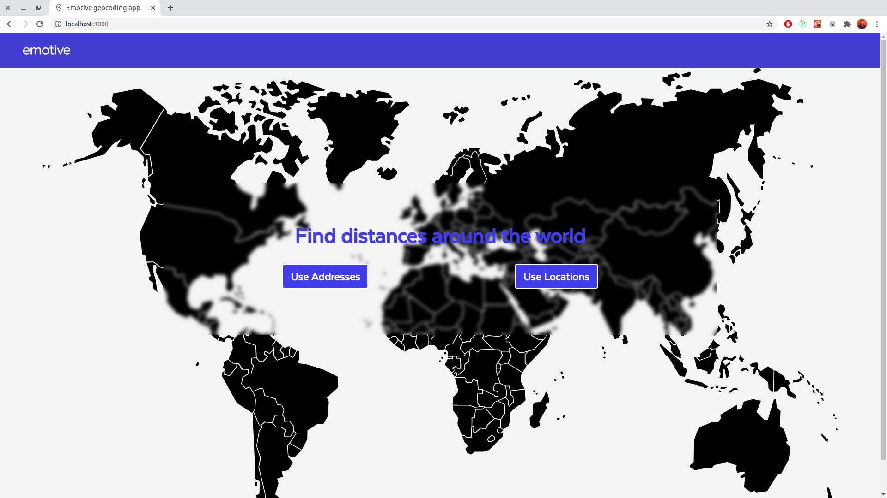

# Geocoding web app

[](https://circleci.com/gh/raparicio6/geocoding-react)



## Getting Started

### Installing

Get the latest version of node from the [official website](https://nodejs.org/) or using [nvm](https://github.com/creationix/nvm).  
Nvm approach is preferred.

Install dependencies by running `npm i`.

Create a *.env.correspondingEnv* (e.g. .env.development) file at the root of the project and add:  
```
REACT_APP_GOOGLE_MAPS_API_KEY=<your Google Maps API key>
REACT_APP_GEOCODING_API_BASE_URL=<api_back_url>
```  
By default [Backend](https://github.com/raparicio6/geocoding-node) uses *http://localhost:8080* as the base url.

To start the app by default (development) run:  
`npm start`

To start a specific environment, run:  
`npm run start-env environment`

Also, you can start the app using [docker-compose](https://docs.docker.com/compose/install/). Add your Google Maps API key into `docker-compose.yml` as requested there. Then move Frontend, Backend and the `docker-compose.yml` file to the same directory and run `docker-compose up`. That's it! You can use the app by entering to `localhost:3000`.

### Only building

To only build the application in a specific env, run:  
`npm run build environment`

## Development

### Testing

In order to execute the tests run `npm test`.  
[Jest](https://jestjs.io/) was used as the testing framework along with [Enzyme](https://airbnb.io/enzyme/).

## Built With

* [React](https://reactjs.org/)
* [Redux](https://redux.js.org/)
* [SASS](https://sass-lang.com/)
* [CircleCI](https://circleci.com/)

## Contributing

1. Fork it
2. Create your feature branch (`git checkout -b my-new-feature`)
3. Run the tests (`npm test`)
4. Commit your changes (`git commit -am 'Add some feature'`)
5. Push to the branch (`git push origin my-new-feature`)
6. Create new Pull Request

## About

This project was written and is maintained by [Rodrigo Aparicio](https://github.com/raparicio6).
